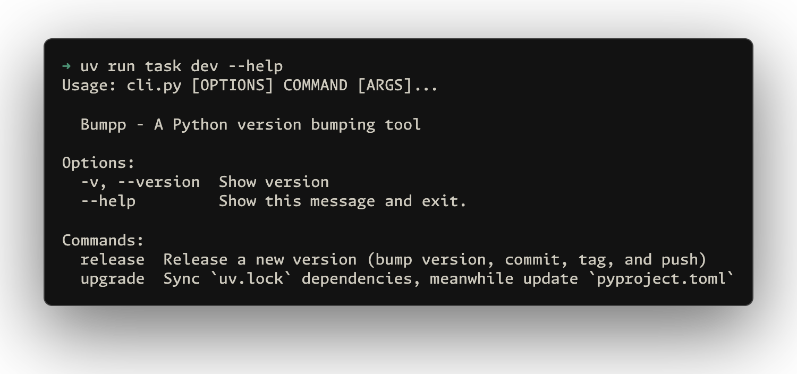
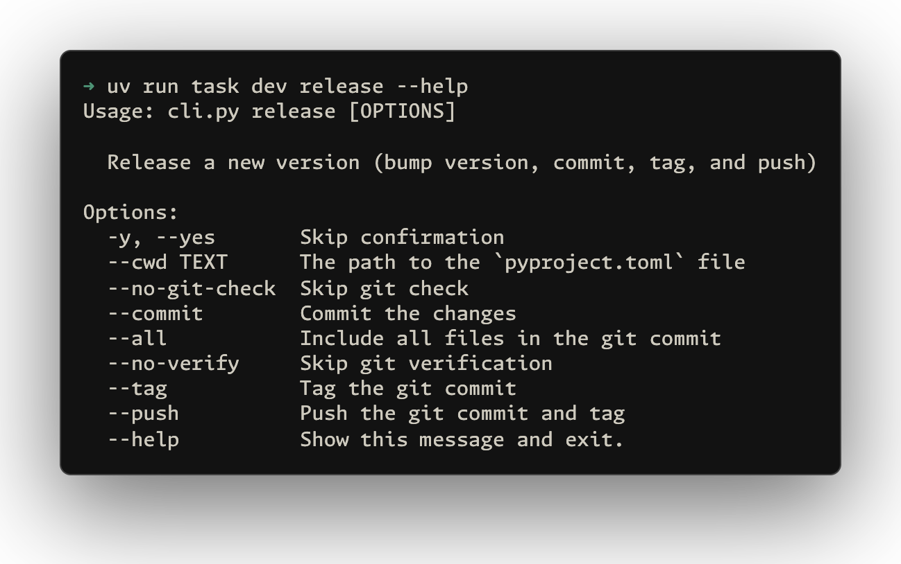
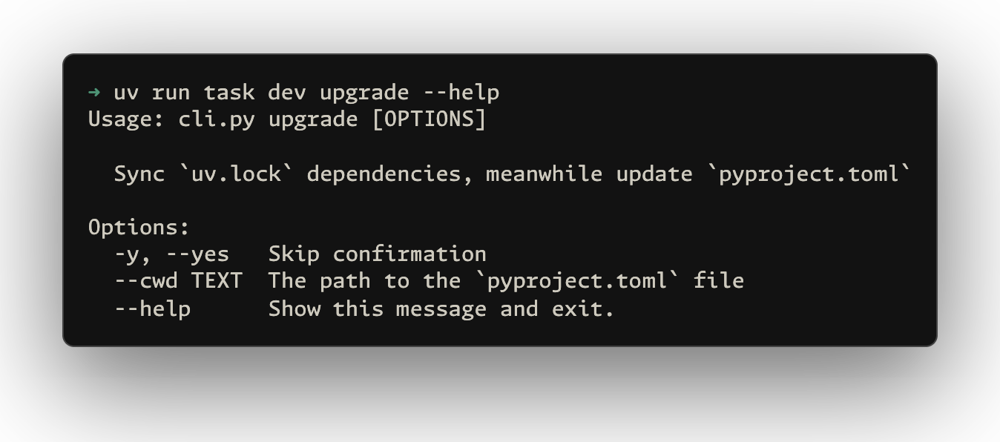

# uvbump

[![python version][python-version-src]][python-version-href]
[![python downloads][python-downloads-src]][python-downloads-href]
[![python versions][python-versions-src]][python-versions-href]
[![License][license-src]][license-href]

A Python version bumping tool for projects using `pyproject.toml` and `uv`.

<p align='center'>

</p>

```sh
pip install uvbump
```

## Release

Bump version, commit, tag, and push:

```sh
uvbump release
```

<p align='center'>

</p>

Options:
- `--cwd <path>` - Path to `pyproject.toml` (default: `.`)
- `-y, --yes` - Skip confirmation
- `--no-git-check` - Skip git status check
- `--commit` - Commit changes (default: enabled)
- `--tag` - Create git tag (default: enabled)
- `--push` - Push commit and tag (default: disabled)
- `--all` - Include all files in commit
- `--no-verify` - Skip git hooks

## Upgrade

Sync `uv.lock` and update dependency versions in `pyproject.toml`:

```sh
uvbump upgrade
```

<p align='center'>

</p>

Options:
- `--cwd <path>` - Path to `pyproject.toml` (default: `.`)
- `-y, --yes` - Skip confirmation

## License

[MIT](./LICENSE) License © [jinghaihan](https://github.com/jinghaihan)

<!-- Badges -->

[python-version-src]: https://img.shields.io/uvbump/v/uv.svg
[python-version-href]: https://pypi.python.org/pypi/uvbump
[python-downloads-src]: https://static.pepy.tech/personalized-badge/uvbump
[python-downloads-href]: https://pypi.python.org/pypi/uvbump
[python-versions-src]: https://img.shields.io/pypi/pyversions/uvbump.svg
[python-versions-href]: https://pypi.org/project/uvbump
[license-src]: https://img.shields.io/uvbump/l/uv.svg
[license-href]: https://github.com/jinghaihan/uvbump/LICENSE
